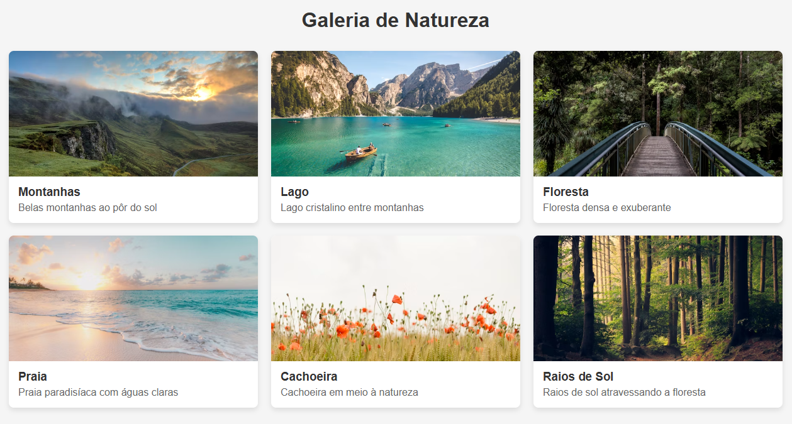

# Galeria de Natureza Responsiva

Este projeto demonstra a implementação de um layout responsivo usando apenas HTML e CSS, sem o uso de frameworks ou bibliotecas externas.

  

## Descrição

Uma galeria de imagens com tema de natureza que se adapta a diferentes tamanhos de tela através do uso de media queries. O design responsivo garante uma experiência visual adequada em dispositivos de vários tamanhos, desde desktops até smartphones.

## Recursos Utilizados

- HTML5 para estruturação de conteúdo
- CSS3 para estilização
- Flexbox para o layout responsivo
- Media Queries para definição de breakpoints
- Imagens do Unsplash (banco de imagens gratuito)

## Breakpoints Implementados

O layout se adapta automaticamente com base nos seguintes breakpoints:

1. **Desktop (≥1280px)**: Exibe 6 imagens em 6 colunas
2. **Tablet (768px-1279px)**: Exibe imagens em 3 colunas
3. **Dispositivos médios (480px-767px)**: Exibe imagens em 2 colunas
4. **Smartphones (<480px)**: Exibe imagens em 1 coluna única

## Estrutura do Projeto

- `index.html` - Contém a estrutura HTML da galeria
- `style.css` - Contém todos os estilos e media queries para o layout responsivo
- `screenshot.png` - Imagem do README.md

## Como Visualizar

1. Clone ou baixe este repositório
2. Abra o arquivo `index.html` em qualquer navegador moderno
3. Redimensione a janela do navegador para visualizar o comportamento responsivo ou use as ferramentas de desenvolvedor do navegador para simular diferentes dispositivos

## Funcionalidades

- Layout flexível que se adapta a diferentes tamanhos de tela
- Efeito de elevação (hover) nos blocos da galeria
- Imagens otimizadas para carregamento rápido

## Créditos

Imagens fornecidas por [Unsplash](https://unsplash.com)

## Atividade Acadêmica

Este projeto foi desenvolvido como parte da disciplina de Desenvolvimento Responsivo do curso de Desenvolvimento Web da Anhanguera.
